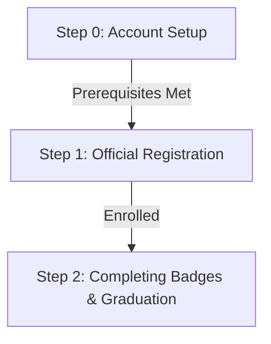

# 🎮 Google Cloud Arcade Facilitator Program 2026 - Ultimate Guide

Welcome to the central repository and comprehensive documentation hub for the **Google Cloud Arcade Facilitator Program 2026**. This repository is designed to be your one-stop-shop, providing step-by-step instructions, account setup guidelines, and badge tracking assistance to help you successfully navigate the program.

> [!IMPORTANT]
> **License & Terms of Use**  
> This work is licensed under a [Creative Commons Attribution-NonCommercial-NoDerivatives 4.0 International License (CC BY-NC-ND 4.0)](LICENSE).
> 
> You are free to share and read this guide. However, under this license, you **must give appropriate credit**, you **cannot use this material for commercial purposes** (such as monetized YouTube videos, blogs, or paid courses), and if you remix/transform the material, you **cannot distribute the modified version**.

---

## 🗺️ Program Roadmap

Below is the structured path for the facilitator program. Ensure you complete each phase sequentially to avoid disqualification.

---

## 📂 Navigation & Resources

| Phase | Description |
| :--- | :--- |
| [Step 0: Account Setup](registration/00_setup.md) | Prerequisites (GCSB setup, Public Profile, Developer Portal, & GEAR Badge) |
| [Step 1: Registration](registration/01_registration.md) | Official Registration & Program Enrollment |
| [Step 2: Badges Tracking](registration/02_tracking.md) | Badges Tracking & Milestone Guidelines |
| [Workaround: Fix CAPTCHA](guides/fix-captcha-issue.md) | Workaround for the GCSB reCAPTCHA dialog bug |

---

## ⚠️ Core Program Rules

Before starting, please keep the following rules in mind:
*   **One Email Rule:** You must use the **exact same email address** across all platforms (Google Cloud Skills Boost, Google Developer Program, and the Arcade subscription/registration forms). Using different email addresses will result in **disqualification**.
*   **No Fake Names:** Ensure your profile names match your real details to avoid account flag risks.
*   **Incognito/Private Browsing:** We highly recommend using an Incognito window when claiming badges or logging in to prevent your browser from automatically selecting wrong Google accounts.

---

## 🤝 Contribution & Feedback

If you notice any outdated links, typos, or want to suggest improvements, feel free to open a Pull Request or raise an Issue in this repository.

*Happy learning and facilitating!* 🚀
