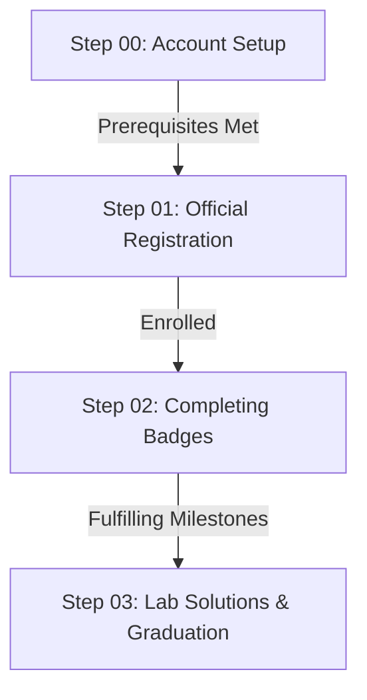

# 🎮 Google Cloud Arcade Facilitator Program 2026 - Ultimate Guide

Welcome to the central repository and comprehensive documentation hub for the **Google Cloud Arcade Facilitator Program 2026**. This repository is designed to be your one-stop-shop, providing step-by-step instructions, account setup guidelines, badge tracking assistance, and solutions to help you successfully navigate the program.

---

## 🗺️ Program Roadmap

Below is the structured path for the facilitator program. Ensure you complete each phase sequentially to avoid disqualification.

---

## 📂 Navigation & Resources

| Phase | Description | Link | Status |
| :--- | :--- | :---: | :---: |
| **Step 00** | **Account Setup & Prerequisites** (GCSB setup, Public Profile, Developer Portal, & GEAR Badge) | [Go to Step 00 ➔](registration/00_setup.md) | 🟢 Complete |
| **Step 01** | **Official Registration & Program Enrollment** | [Go to Step 01 ➔](registration/01_registration.md) | 🟢 Complete |
| **Step 02** | **Badges Tracking & Milestone Guidelines** | [Go to Step 02 ➔](registration/02_tracking.md) | 🟢 Complete |
| **Step 03** | **Lab Solutions & Walkthroughs** | [Go to Step 03 ➔](registration/03_solutions.md) | 🟡 Pending |

---

## ⚠️ Core Program Rules

Before starting, please keep the following rules in mind:
*   **One Email Rule:** You must use the **exact same email address** across all platforms (Google Cloud Skills Boost, Google Developer Program, and the Arcade subscription/registration forms). Using different email addresses will result in **disqualification**.
*   **No Fake Names:** Ensure your profile names match your real details to avoid account flag risks.
*   **Incognito/Private Browsing:** We highly recommend using an Incognito window when claiming badges or logging in to prevent your browser from automatically selecting wrong Google accounts.

---

## 🤝 Contribution & Feedback

If you notice any outdated links, typos, or want to contribute lab solutions, feel free to open a Pull Request or raise an Issue in this repository.

*Happy learning and facilitating!* 🚀
