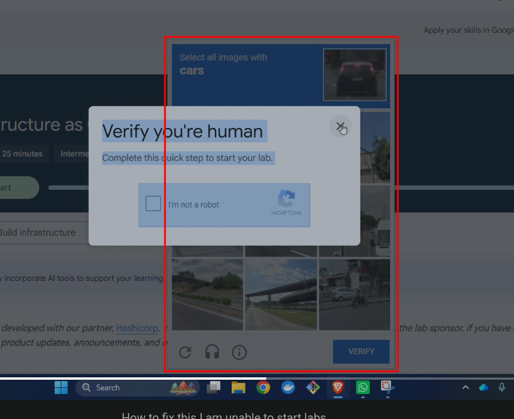

[🏠 Home](../README.md) / **Fix CAPTCHA Issue**

---

# 🛠️ How to Fix the Google Cloud Skills Boost CAPTCHA Issue

Many users and students are currently facing issues with the **reCAPTCHA dialog** when claiming credits or starting labs, where the verification window malfunctions or fails to load. 

Until Google officially resolves this bug, you can use the workaround described below to bypass the broken element.



---

## 📽️ Video Walkthrough

Here is a short screen recording showing how to apply the fix:


*(If the GIF above doesn't load, you can also [watch/download the raw MP4 video directly](../media/fix-captcha.mp4)).*

---

## ⚡ Step-by-Step Workaround

Follow these steps to bypass the problematic reCAPTCHA dialog element:

### Step 1: Open Developer Tools
When claiming credits, click the **CAPTCHA** button. Once the verification dialog appears (asking you to select bicycles, traffic lights, etc.), press **F12** (or `Ctrl+Shift+I` / `Cmd+Option+I`) to open your browser's **Developer Tools**.

### Step 2: Enable Console Pasting
1. Navigate to the **Console** tab at the top of the Developer Tools panel.
2. If this is your first time pasting code into the console, type the following text and press **Enter**:
   ```text
   allow pasting
   ```
   *(If you see any warning or error message, you can safely ignore it).*

### Step 3: Run the Fix Script
Copy the JavaScript code below, paste it into the console, and press **Enter**:

```javascript
(() => {
  document.querySelectorAll('ql-dialog').forEach(el => {
    const old = el.shadowRoot?.querySelector('dialog');
    if (!old) return; // Skip if no shadow DOM or no <dialog>

    const neo = document.createElement('dialog-remove');
    [...old.attributes].forEach(a => neo.setAttribute(a.name, a.value));
    neo.append(...old.childNodes); // Moves all children at once
    
    old.replaceWith(neo);
  });
  console.log("✅ <dialog> replacement complete.");
})();
```

Once executed, the CAPTCHA window will refresh and function as expected.

---

## 🔍 How It Works Under the Hood

The root cause of this bug is a specific web component (`<dialog>`) within the custom `ql-dialog` element that interferes with the reCAPTCHA layout. 

The script above inspects the web page, finds all `<dialog>` elements inside the Shadow DOM of `<ql-dialog>`, and renames them to `<dialog-remove>`. This prevents the problematic browser styles from breaking the CAPTCHA container, allowing the reCAPTCHA challenge to load properly.

---

## ⚠️ Important Security Reminder

> [!WARNING]
> **CRITICAL SECURITY NOTE:**
> Paste-jacking is a common browser exploit. As a general security rule:
> * **Never paste any code or script** into your browser's Developer Console unless you understand exactly what it does and trust the source completely.
> * Always inspect the script before running it. 
> * If you are sharing this workaround with your students or other users, **please share this entire message (including this warning)** so they are aware of browser console safety practices.
