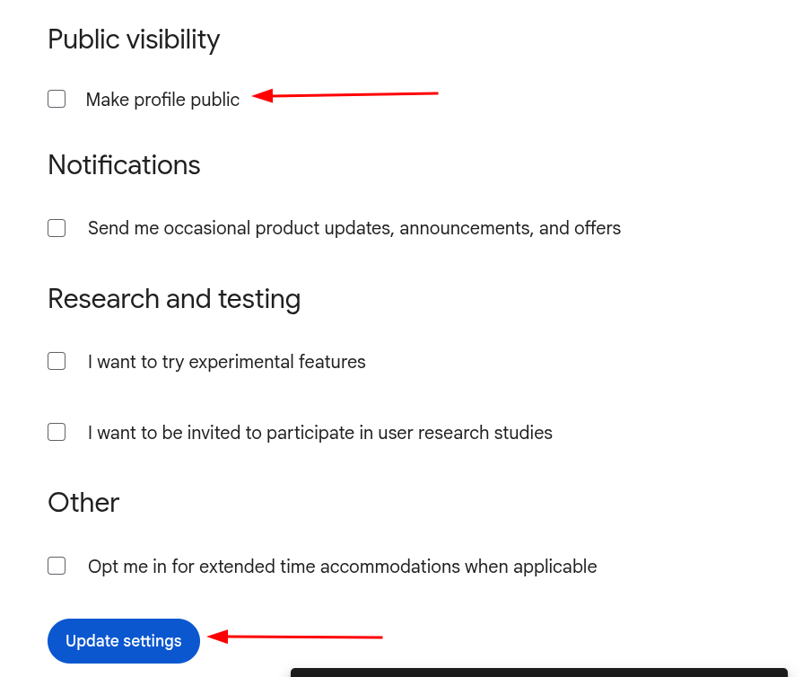
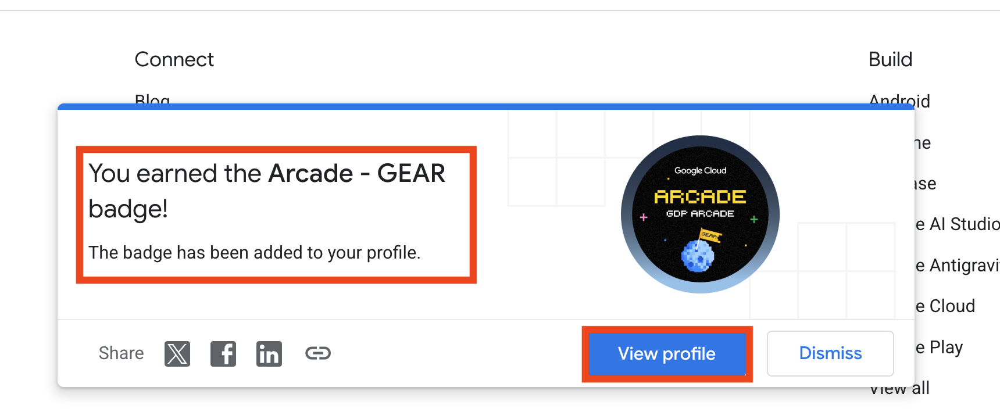

[🏠 Home](../README.md) / **Step 0: Account Setup**

---

# Step 0: Account Setup & Prerequisites

Before you can officially enroll in the Arcade Facilitator Program, you must set up your accounts and claim the prerequisite badges. 

> [!WARNING]
> **CRITICAL RULE: USE A SINGLE EMAIL ADDRESS**
> All steps and accounts MUST be set up using a single, consistent email address. If you use different email addresses to register on different platforms, **you will be disqualified from the program.**

---

## 🛠️ Step 1: Create a Google Cloud Skills Boost (GCSB) Account

1. Go to the [Google Cloud Skills Boost Website](https://www.skills.google/).
2. Create a fresh account using a **new email ID** (one that you have never used for any Google events).
   
   > [!IMPORTANT]
   > Please enter your **correct legal name and details** while creating your GCSB account. Fake names or duplicate accounts will result in immediate disqualification.
3. Once you sign up/join, log in to your account.
4. Go to your **Profile Settings**.
5. Scroll down to the public profile section and make your profile **PUBLIC**. This will generate a public profile URL where all your earned badges will be displayed.

### Visual Reference: Making Profile Public

### Visual Reference: Public Profile Link

> [!NOTE]
> This public profile URL is extremely important throughout the event. It is used to track and verify your progress in earning Arcade badges and showcases your Google Cloud Platform (GCP) skills. You can also add it to your LinkedIn profile to highlight your learning path!

---

## ⚙️ Step 2: Join the Google Developer Program & Earn the Gemini Enterprise Agent Ready (GEAR) Badge

To be eligible for bonus points, you must sign up and earn the **Gemini Enterprise Agent Ready (GEAR)** badge. This is a mandatory step that must be completed before or during enrollment.

- **Developer Program Link:** [Google Developer Program - GEAR](https://developers.google.com/program/gear)
- 📹 [Video Guide on YouTube](https://youtu.be/_vTVDxbVlhQ?si=v85HZT96IibIfR5M)
- 🗃️ [Official PDF Instructions Guide](https://services.google.com/fh/files/helpcenter/gear_badge_instructions.pdf)

> [!WARNING]
> **Check Your Logged-In Account:** If you have multiple Google accounts logged in on your browser, the developer portal might randomly choose another account. Make sure you switch to the same email address you used for GCSB. If you face issues, complete this step inside an **Incognito/Private window**.

---

## 🛡️ Step 3: Earn the "Arcade - GEAR" Digital Badge (Under 1 Minute)

> [!IMPORTANT]
> **BOTH BADGES ARE MANDATORY:** 
> The **Gemini Enterprise Agent Ready (GEAR)** badge (from Step 2) and the **Arcade - GEAR** digital badge (from this step) are **two different badges**. You must earn **both** to qualify for the program benefits.

Follow the steps below to claim your **Arcade - GEAR** digital badge:

1. **Sign In/Join:** Visit the [Google Developer Portal (me.developers.google.com)](https://me.developers.google.com/u/me). Click **"Join the program"** and then **"Sign in"** using your registered program email. *(Skip this if you are already signed in).*
2. **Claim Badge:** Navigate to the [GEAR Arcade Award Page](https://developers.google.com/profile/badges/community/gear/arcade/award).
3. **Wait on Page:** Once the page loads, **wait for 10-15 seconds**. Do not navigate away and do not click anything.
4. **Confirm Success Toast:** You will see a toast message at the bottom of the screen (similar to the screenshot below) confirming you have successfully earned the **Arcade - GEAR** badge.
   
   
5. **Verify Profile:** Click on **"View Profile"** to verify that the **Arcade - GEAR** badge is visible on your developer profile.

---

## 📩 Step 4: Subscribe to the Arcade & Register

Visit the Arcade Page and click on the **Subscribe** button (use the same email ID that you used to create your GCSB account):
👉 [Google Cloud Arcade Page](https://go.cloudskillsboost.google/arcade)

**OR**

Fill out the official Arcade registration form directly using this link:
👉 [Official Arcade Registration Form](https://forms.gle/2h6xCvY3sW29pw4p7)

---

🎉 **Prerequisites Complete!** Once you have completed all the steps above, your accounts are ready. You are now prepared for the next phase:

👉 **[Proceed to Step 1: Official Registration & Enrollment](01_registration.md)**
