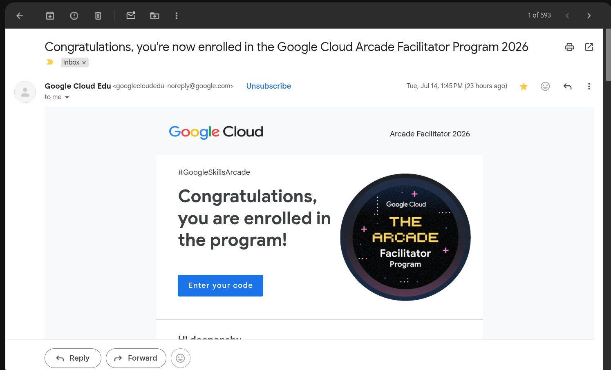
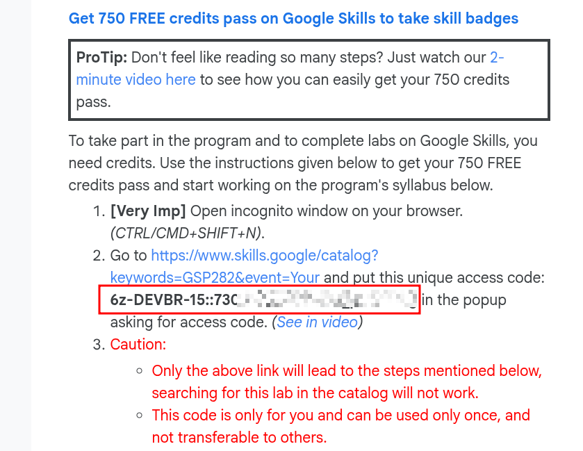

[🏠 Home](../README.md) / [Step 0: Account Setup](00_setup.md) / **Step 1: Registration**

---

# Step 1: Official Registration & Credit Redemption

Once you have set up all your accounts in [Step 0 (Account Setup)](00_setup.md), you are ready to officially register for the program and claim your learning credits.

---

## 📝 Step 1: Fill Out the Official Registration Form

1. Go to the official registration form using the link below:
   
   👉 **[Official Registration Form](https://docs.google.com/forms/d/e/1FAIpQLScjkkpNBMs0xR_EvqwLFQZRRVXccQQTLl-pUA37NvzvUQ3NJQ/viewform)**

2. **Enter the Referral Code:** During form submission, make sure you use the referral code below:
   
   `GCAF26-IN-4WC-5QG`

   > [!IMPORTANT]
   > **Do Not Skip the Referral Code:** If you do not enter this referral code, you will **not** receive the credits required to complete the program's skill badges. Using the referral code unlocks up to **750 credits**.

3. **Check Prerequisites:** The form will ask for the prerequisites (like the public GCSB profile and GEAR badge) that you already completed in [Step 0](00_setup.md). Fill in all required links carefully.
4. **Submit and Wait:** Ensure all information is correct and submit the form. It will take **24 to 48 hours** to receive your official confirmation email.

---

## 📩 Step 2: Claiming Your 750 Credits

Once you receive your confirmation email (which will look like the screenshot below), follow these steps to claim your credits.

### Visual Reference: Confirmation Mail Example

---

### 🔻 Steps to Redeem the Credits

> [!TIP]
> While we highly recommend reading the entire confirmation email, you can follow this quick overview to redeem your credits smoothly.

1. **Open the Catalog Link in Incognito:** Open an **Incognito/Private window** and navigate to this link:
   
   👉 [Google Cloud Skills Boost Catalog Page](https://www.skills.google/catalog?keywords=GSP282&event=Your)

2. **Enter the Code:** **Before logging in**, copy the unique redemption code from your email and paste it into the input dialog box on the page.
   
   

3. **Log In:** After pasting the code, log in to your GCSB account.
4. **Check for 9 Credits:** Verify that your profile balance shows **9 credits**.
   
   > [!WARNING]
   > If you do not see these 9 credits, it means the redemption process was not followed correctly. Go back to **Sub-step 1** of this redemption guide (opening the catalog link in incognito, pasting the code *before* logging in) and try the process again until you see the 9 credits.

5. **Start and Complete the Lab:** 
   * Click on the lab titled **"A Tour of Google Cloud Hands-on Labs"**.
   * Click the green **"Start Lab"** button.
   * **Complete the lab 100%** and make sure you spend **at least 10 minutes** inside the lab.
   * Once you finish and end the lab, you will see **750 credits** added to your profile (this may take 2–3 minutes to reflect).
   
   > [!NOTE]
   > To verify your updated credit balance, visit your account credits page:
   > 👉 [Google Cloud Skills Boost - My Account Credits](https://www.skills.google/my_account/credits)

🎥 **Need help?** Check out the [Credits Redemption Reference Video](https://www.youtube.com/watch?v=WVdUW1wJwyI) for a step-by-step walkthrough.

---

> [!CAUTION]
> **CRITICAL LAB NOTICE FOR BEGINNERS:**
> When completing the lab, **always use the temporary credentials provided by the lab (Username & Password)**. Do **NOT** use your own personal account inside the GCP Console.
> 
> Because you are working in an Incognito window, you will have two Google accounts active: your main account logged in on Skills Boost, and the temporary lab credentials account on Google Cloud Console. Make sure to complete all console actions using the **lab credentials account**. This is the most common mistake made by beginners.

---

🎉 **Credits Added!** Once you see the credits reflected in your account, you are ready to start earning badges and tracking milestones.

👉 **[Proceed to Step 2: Badges Tracking & Milestone Guidelines](02_tracking.md)**
