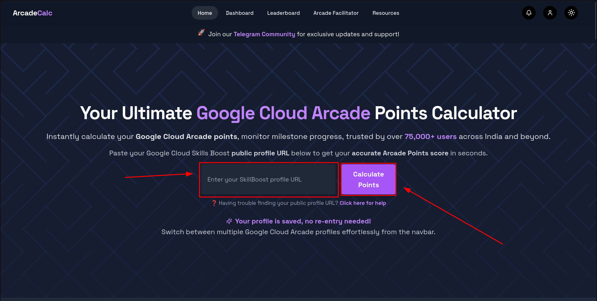
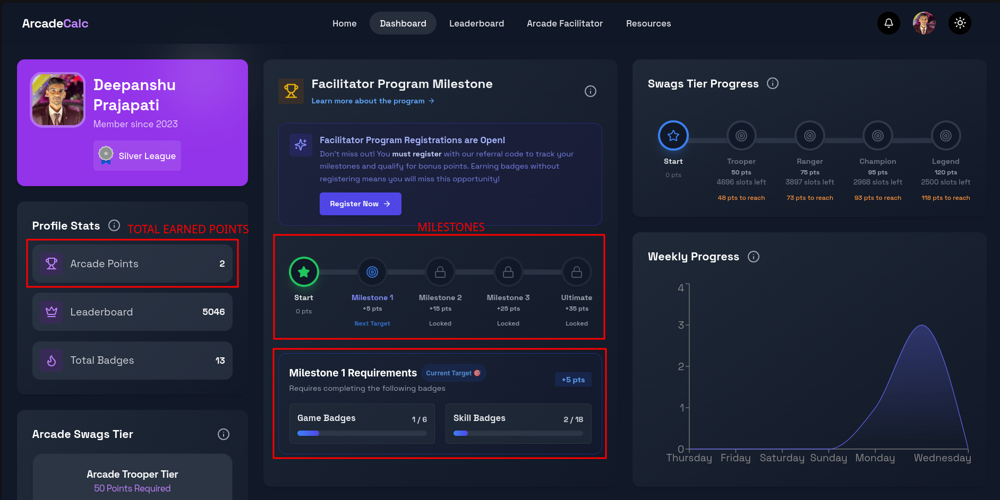

[🏠 Home](../README.md) / [Step 0: Account Setup](00_setup.md) / [Step 1: Registration](01_registration.md) / **Step 2: Tracking**

---

# Step 2: Progress Tracking & Badge Strategy

To successfully complete the Arcade Facilitator Program, you need a way to track your points and systematically complete the required badges.

---

## 📊 Automated Tracking (Via Arcade Points Calculator)

For a quick, interactive visual dashboard of your profile stats, you can use the community-built **Arcade Points Calculator**.

👉 **[Access the Arcade Points Calculator](https://arcadecalc.netlify.app/)**

### Step-by-Step Dashboard Setup:

1. **Get Your GCSB Public Profile Link:** 
   Recall the public profile link you generated during the account setup phase in [Step 0](00_setup.md).
   
   

2. **Submit Your URL on ArcadeCalc:**
   Navigate to [arcadecalc.netlify.app](https://arcadecalc.netlify.app/) and paste your GCSB public profile URL into the input field.
   
   

3. **Explore Your Profile Dashboard:**
   Once submitted, you will be redirected to your personal dashboard. Here you will see all your profile statistics aggregated in one place, including:
   * Total earned points.
   * Milestone requirements and progress bars.
   * Breakdown of bonus points per milestone.
   
   

---

## 🎯 Recommended Badge Strategy

> [!TIP]
> **Game Badges First!**
> We highly recommend completing the **Game Badges** first, and then only moving ahead to complete the **Skill Badges**. Game badges are usually time-limited and crucial for building initial points, whereas skill badges require credit consumption and can be systematically earned afterwards.
> 
> **⚡ Fast-Track Skill Badges:** Unlike Game Badges (which require you to complete every single lab under the badge), you can earn **Skill Badges** instantly by skipping directly to the final **Challenge Lab**. Look for the challenge options on the GCSB course pages to save time and credits!

---

🎉 **Tracking Set Up!** Now that you know how to track your progress and plan your badges, you are ready to tackle the labs.
