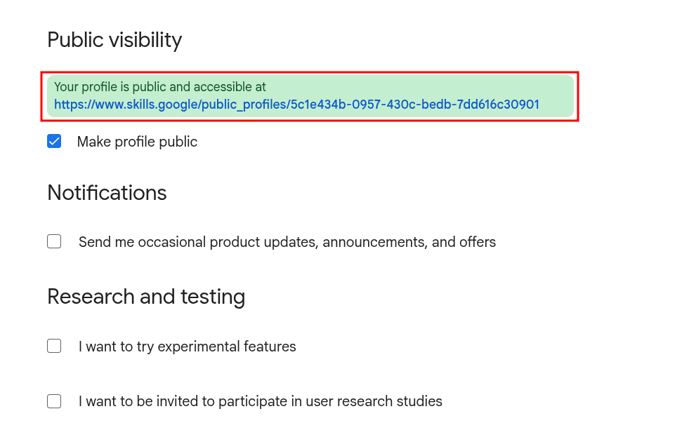
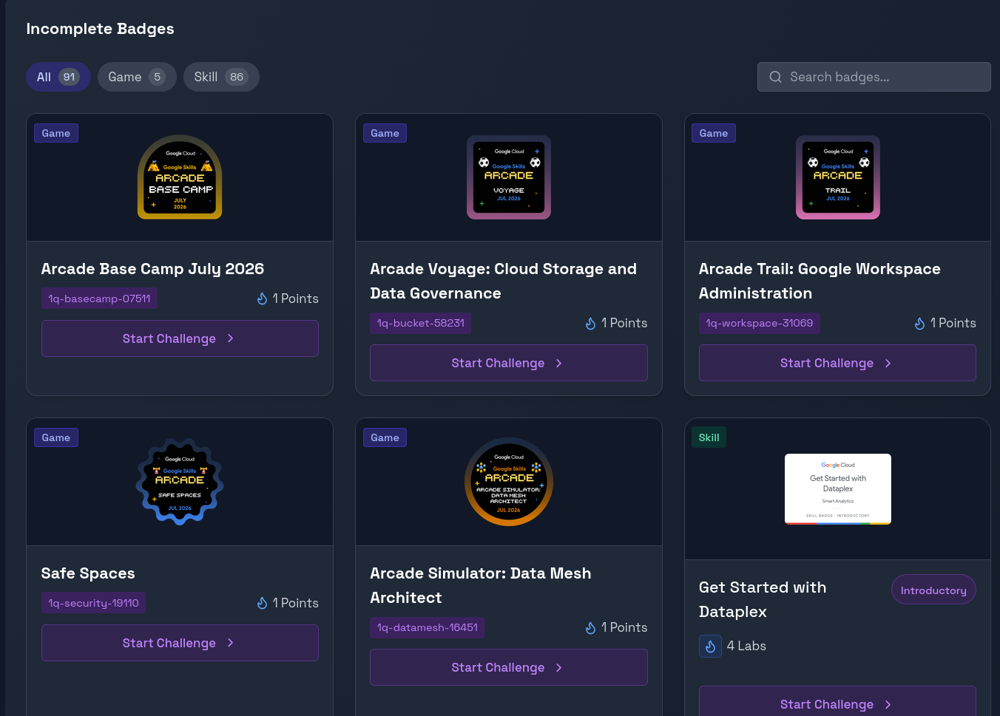

# Step 02: Progress Tracking & Badge Strategy

To successfully complete the Arcade Facilitator Program, you need a way to track your points and systematically complete the required badges.

---

## 📊 Automated Tracking (Via Arcade Points Calculator)

For a quick, interactive visual dashboard of your profile stats, you can use the community-built **Arcade Points Calculator**.

👉 **[Access the Arcade Points Calculator](https://arcadecalc.netlify.app/)**

### Step-by-Step Dashboard Setup:

1. **Get Your GCSB Public Profile Link:** 
   Recall the public profile link you generated during the account setup phase in [Step 00](00_setup.md).
   
   

2. **Submit Your URL on ArcadeCalc:**
   Navigate to [arcadecalc.netlify.app](https://arcadecalc.netlify.app/) and paste your GCSB public profile URL into the input field.
   
   

3. **Explore Your Profile Dashboard:**
   Once submitted, you will be redirected to your personal dashboard. Here you will see all your profile statistics aggregated in one place, including:
   * Total earned points.
   * Milestone requirements and progress bars.
   * Breakdown of bonus points per milestone.
   
   

4. **Identify Incomplete Badges:**
   Scroll down on your dashboard to find the **Incomplete Badges** section. This lists all the eligible badges remaining on Google Cloud Skills Boost that you need to complete.
   
   

---

## 🛤️ How to Complete Your Incomplete Badges

Once you identify your incomplete badges, you can choose one of the following two approaches to complete them:

### ⚡ Approach 1: Direct Completion via Dashboard
*   **How it works:** You can click directly on any badge shown in the **Incomplete Badges** section of the [Arcade Points Calculator](https://arcadecalc.netlify.app/) dashboard.
*   **Best for:** Quickly finding and jumping into a specific badge without navigating search lists.

### 📚 Approach 2: Structured Syllabus Sheet (Recommended for Beginners)
*   **How it works:** You can use our specially crafted syllabus sheet where the badges are arranged in a structured format, making it very easy for beginners to complete them step-by-step.
*   **Best for:** Beginners who want a guided learning path. It includes the badge name, the direct link, and a solution playlist.
*   **Access the Syllabus:**
    👉 **[Syllabus & Badges Checklist](../syllabus/badges.md)**

---

## 🎯 Recommended Badge Strategy

> [!TIP]
> **Game Badges First!**
> We highly recommend completing the **Game Badges** first, and then only moving ahead to complete the **Skill Badges**. Game badges are usually time-limited and crucial for building initial points, whereas skill badges require credit consumption and can be systematically earned afterwards.

---

🎉 **Tracking Set Up!** Now that you know how to track your progress and plan your badges, you are ready to tackle the labs.

👉 **[Proceed to Step 03: Lab Solutions & Walkthroughs](03_solutions.md)**
